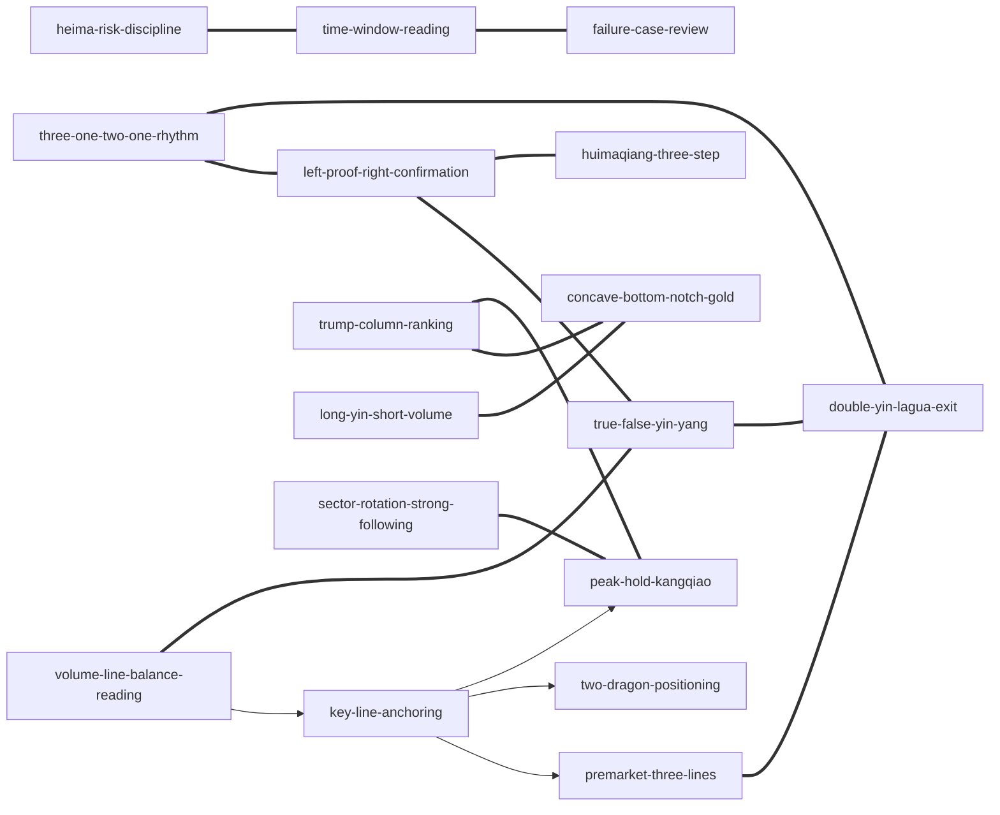

# 黑马王子操盘手记系列 — Skill Index

> 本书由 cangjie-skill 蒸馏，共产出 **17** 个 skills。
> 处理时间: 2026-07-22

## 关于这本书

- **作者**: 黑马王子；书内多处称“张得一教授”，署名关系按书内表述处理。
- **出版年**: 约 2016-2017；逐册精确年份不确定。
- **一句话主旨**: 用量柱、价柱、量线和量波识别 A 股行情中的主力行为痕迹，并训练读者在关键平衡位上做预判、伏击、持有、退出和复盘。
- **整书理解**: [BOOK_OVERVIEW.md](./BOOK_OVERVIEW.md)
- **精华长文**: [DIGEST.md](./DIGEST.md)
- **术语词典**: [GLOSSARY.md](./GLOSSARY.md)

## Skill 列表

### 纪律与训练

- [`heima-risk-discipline`](./heima-risk-discipline/SKILL.md) — 交易前风险门禁：四不得四不要、训练门槛、不要代操荐股。
- [`time-window-reading`](./time-window-reading/SKILL.md) — 把历史盘前/收评变成预测-对照-校正训练。
- [`failure-case-review`](./failure-case-review/SKILL.md) — 定位当时、放眼全局、抓住重点地复盘失败。

### 量学底座

- [`volume-line-balance-reading`](./volume-line-balance-reading/SKILL.md) — 用量柱、价柱、量线、量波读动态平衡。
- [`key-line-anchoring`](./key-line-anchoring/SKILL.md) — 验证灯塔线、平衡线、太极线、精准线是否有根。
- [`premarket-three-lines`](./premarket-three-lines/SKILL.md) — 用上线、中线、下线构造盘前预案和失效条件。
- [`three-one-two-one-rhythm`](./three-one-two-one-rhythm/SKILL.md) — 用 3121 处理时间、空间、量能和分级动作。
- [`two-dragon-positioning`](./two-dragon-positioning/SKILL.md) — 用平斜二龙交叉判断变盘节点和叉上/叉下预案。

### 信号确认

- [`left-proof-right-confirmation`](./left-proof-right-confirmation/SKILL.md) — 区分左证明和右确认，防止抢跑。
- [`true-false-yin-yang`](./true-false-yin-yang/SKILL.md) — 辨别假阴真阳、假阳真阴和阴阳胜负。
- [`long-yin-short-volume`](./long-yin-short-volume/SKILL.md) — 识别长阴短柱、缩量假跌和极阴次阳。
- [`trump-column-ranking`](./trump-column-ranking/SKILL.md) — 判断黄金柱、将军柱、元帅柱、王牌柱质量。

### 机会与接力

- [`huimaqiang-three-step`](./huimaqiang-three-step/SKILL.md) — 用趋势、回踩极限和触发瞬间破解回马枪。
- [`concave-bottom-notch-gold`](./concave-bottom-notch-gold/SKILL.md) — 用多证据组合筛选凹底/凹口淘金。
- [`peak-hold-kangqiao`](./peak-hold-kangqiao/SKILL.md) — 判断过峰保顶、康桥接力和突破后回踩。
- [`sector-rotation-strong-following`](./sector-rotation-strong-following/SKILL.md) — 把板块当作股票，判断热点轮动和强者领衔。

### 防守与退出

- [`double-yin-lagua-exit`](./double-yin-lagua-exit/SKILL.md) — 处理双阴、大阴、跳空阴、上线乏力、拉拐替领。

## 引用图



图例:
- `-->` depends-on
- `===` composes-with

## 推荐学习顺序

1. **`heima-risk-discipline`** — 先明确不能做什么，防止把训练变成实盘冒险。
2. **`time-window-reading`** — 学会按时间窗口读手记，不偷看答案。
3. **`volume-line-balance-reading`** — 建立量柱、价柱、量线、量波的共同语言。
4. **`key-line-anchoring`** 和 **`premarket-three-lines`** — 把读盘转为边界和预案。
5. **`left-proof-right-confirmation`**、**`true-false-yin-yang`**、**`long-yin-short-volume`** — 学会等确认、辨真假。
6. **`trump-column-ranking`**、**`three-one-two-one-rhythm`**、**`two-dragon-positioning`** — 增加柱级、节律和变盘判断。
7. **`huimaqiang-three-step`**、**`concave-bottom-notch-gold`**、**`peak-hold-kangqiao`**、**`sector-rotation-strong-following`** — 再进入机会与接力筛选。
8. **`double-yin-lagua-exit`** 和 **`failure-case-review`** — 最后用防守和复盘闭环。

## 安装使用

本目录是构建产物，宿主不会从这里加载 skill。阶段 5 会在用户确认安装位置后复制通过测试的 skill。

可选位置:

```bash
# 用户级
~/.claude/skills/<skill-slug>/

# 项目级
<project>/.claude/skills/<skill-slug>/
<project>/.cursor/skills/<skill-slug>/
```

## 接入 darwin-skill

所有 skill 都会带有 `test-prompts.json`，可作为 darwin-skill 自动进化的测试基础:

```bash
darwin evolve books/heima-wangzi-caopan-shouji/
```

## 审计轨迹

- 候选单元池: [candidates/](./candidates/)
- 淘汰/降级/捞回记录: [rejected/](./rejected/)
- 三重验证: [verified.md](./verified.md)
- 整书理解: [BOOK_OVERVIEW.md](./BOOK_OVERVIEW.md)
